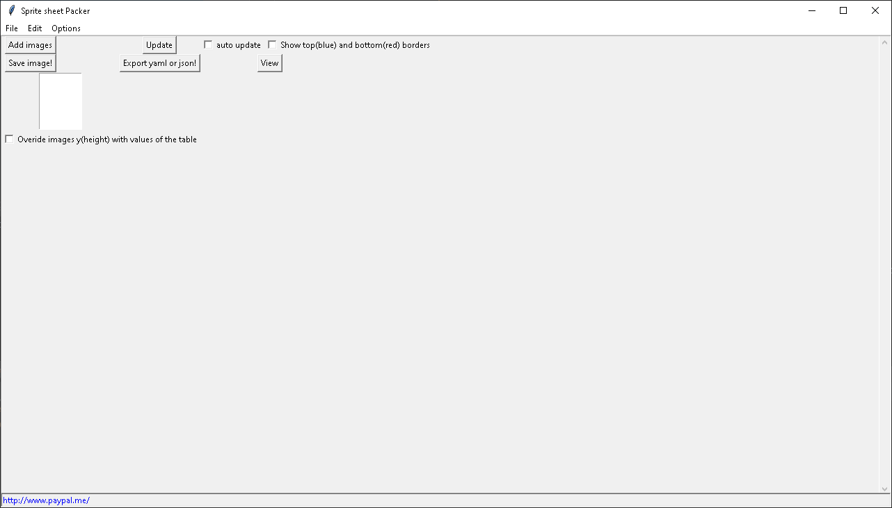

# SpriteSheetPacker
A simple python Sprite sheet maker. It takes separate images and plans them on a new image. Can also export json and yaml files. I make this for my needs.

~~Maybe will update it in the future~~

[comment]: <> (![image]&#40;https://user-images.githubusercontent.com/59426055/125518065-cddf3792-cf36-4d44-a761-4b3b562d3830.png&#41;)

***

### Hotkeys: 

F1 = lets you choose a single image and add it into the row (add one row).  
F2 = lets you choose a multiple images and add them into the rows (add rows).  
F5 = updates 'x' and 'y' cells.  

***

'row' is the rows of images, 'col' is for the corresponding columns.  
Separate frames (frames) is for the nested dict/json/yaml.

The other fields are auto generated. You can tweek them.

***
## USEGE:

Add the frames of a animation useing `Add images` button.   
If used correctly, each line(row) of the image will be a separate animation.
